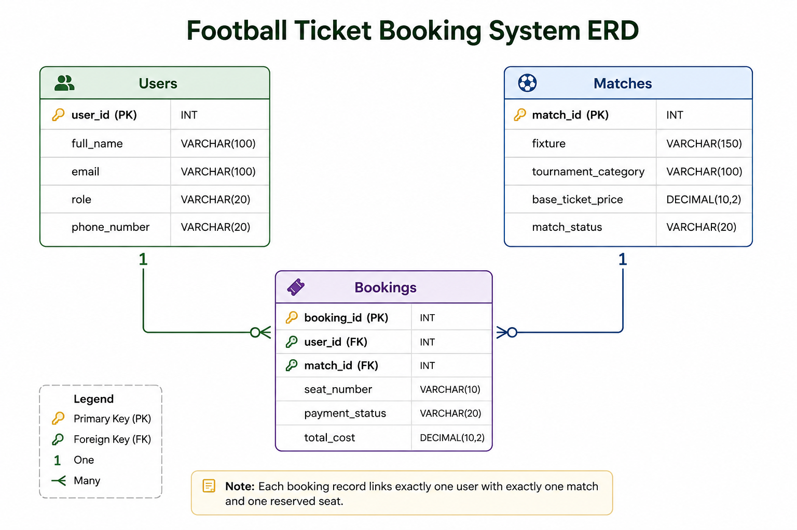

# ⚽ Football Ticket Booking System – Database Design & SQL

A relational database project built using **PostgreSQL** that simulates a Football Ticket Booking System. The project demonstrates relational database design, Entity Relationship Diagram (ERD) modeling, database constraints, and SQL query implementation based on real-world business requirements.

---

## 📖 Project Overview

This project manages football fans, tournament matches, and ticket bookings through a normalized relational database.

The implementation includes:

- Relational Database Design
- Entity Relationship Diagram (ERD)
- Primary & Foreign Keys
- One-to-Many & Many-to-One Relationships
- Referential Integrity
- Database Constraints
- SQL Query Implementation
- Business Logic Modeling

---

# 📊 Entity Relationship Diagram (ERD)

<p align="center">
  
</p>

---

## 🗄️ Database Schema

The system consists of three relational tables.

### 👤 Users

Stores football fans and ticket managers.

| Column | Description |
|---------|-------------|
| user_id (PK) | Unique identifier for each user |
| full_name | User's full name |
| email | Unique email address |
| role | Football Fan / Ticket Manager |
| phone_number | Contact number |

---

### ⚽ Matches

Stores football match information.

| Column | Description |
|---------|-------------|
| match_id (PK) | Unique match identifier |
| fixture | Competing teams |
| tournament_category | Tournament or league |
| base_ticket_price | Base ticket price |
| match_status | Ticket availability status |

---

### 🎟️ Bookings

Stores football ticket booking records.

| Column | Description |
|---------|-------------|
| booking_id (PK) | Unique booking identifier |
| user_id (FK) | References Users table |
| match_id (FK) | References Matches table |
| seat_number | Reserved seat |
| payment_status | Payment status |
| total_cost | Total booking amount |

---

## 🔗 Database Relationships

- One User ➜ Many Bookings
- Many Bookings ➜ One Match
- Each Booking belongs to one User and one Match
- Data integrity maintained through Primary Keys and Foreign Keys

---

## 💻 SQL Features Implemented

- SELECT
- WHERE
- LIKE
- ILIKE
- IS NULL
- COALESCE
- INNER JOIN
- LEFT JOIN
- Aggregate Functions
- Subqueries
- ORDER BY
- LIMIT
- OFFSET

---

## 🛡️ Database Constraints

The project implements several database constraints to ensure data integrity.

- Primary Keys
- Foreign Keys
- UNIQUE Constraint
- CHECK Constraints
- NOT NULL Constraints

---

## 📌 Business Logic

The database supports:

- User Management
- Match Management
- Football Ticket Booking
- Seat Reservation
- Payment Status Tracking
- Match Availability Management

---

## 📂 Repository Structure

```text
football_ticket_booking/
│
├── README.md
├── erd.png
└── query.sql
```

---

## 📄 SQL Script

The `query.sql` file contains:

- Database Creation
- Table Creation
- Primary & Foreign Key Constraints
- CHECK Constraints
- UNIQUE Constraints
- Sample Data Insertion
- SQL Queries for Assignment Requirements

---

## 🛠️ Technologies Used

- PostgreSQL
- SQL
- Lucidchart
- Git
- GitHub

---

## 🎯 Learning Outcomes

Through this project, I gained hands-on experience with:

- Relational Database Design
- Entity Relationship Diagram (ERD)
- Database Constraints
- SQL Query Writing
- JOIN Operations
- Aggregate Functions
- Subqueries
- NULL Handling
- Business Logic Implementation

---

## 🚀 Getting Started

1. Clone this repository.

```bash
git clone https://github.com/harunhira69/football_ticket_booking.git
```

2. Open PostgreSQL.

3. Execute the `query.sql` script.

4. Run the SQL queries included in the script.

---

## 🔗 Project Links

### GitHub Repository

https://github.com/harunhira69/football_ticket_booking

### ERD Design

https://lucid.app/lucidchart/24ad593c-abbd-41f5-bd3b-86290a33af7e/edit

---

## 👨‍💻 Author

**Harun Hira**

- GitHub: https://github.com/harunhira69
- LinkedIn: https://www.linkedin.com/in/YOUR-LINKEDIN-USERNAME/

---

⭐ If you found this project useful, consider giving it a Star.
